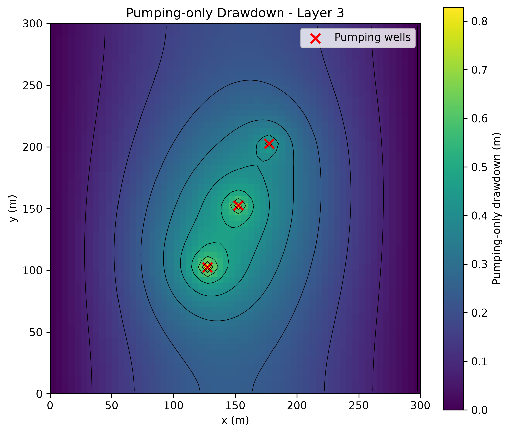
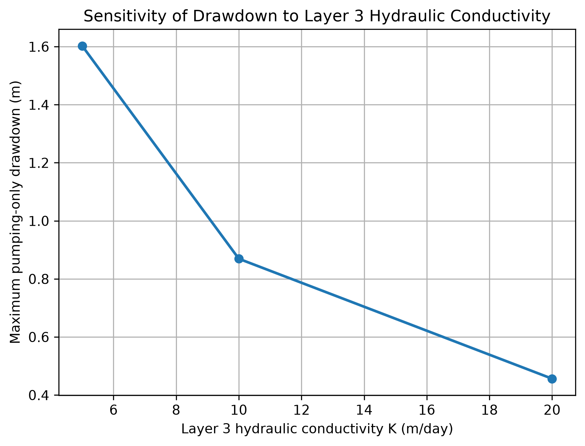
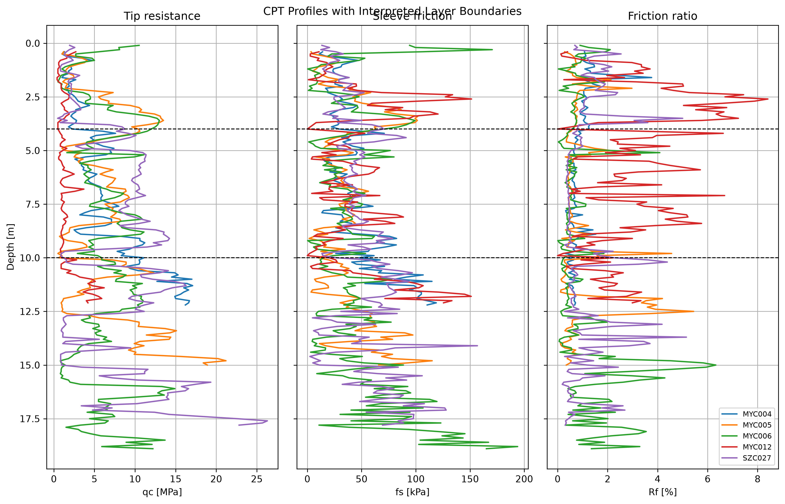
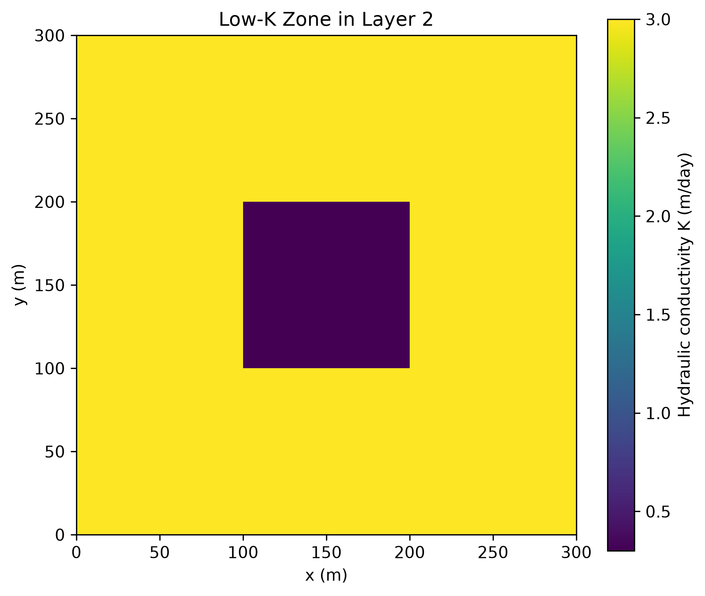
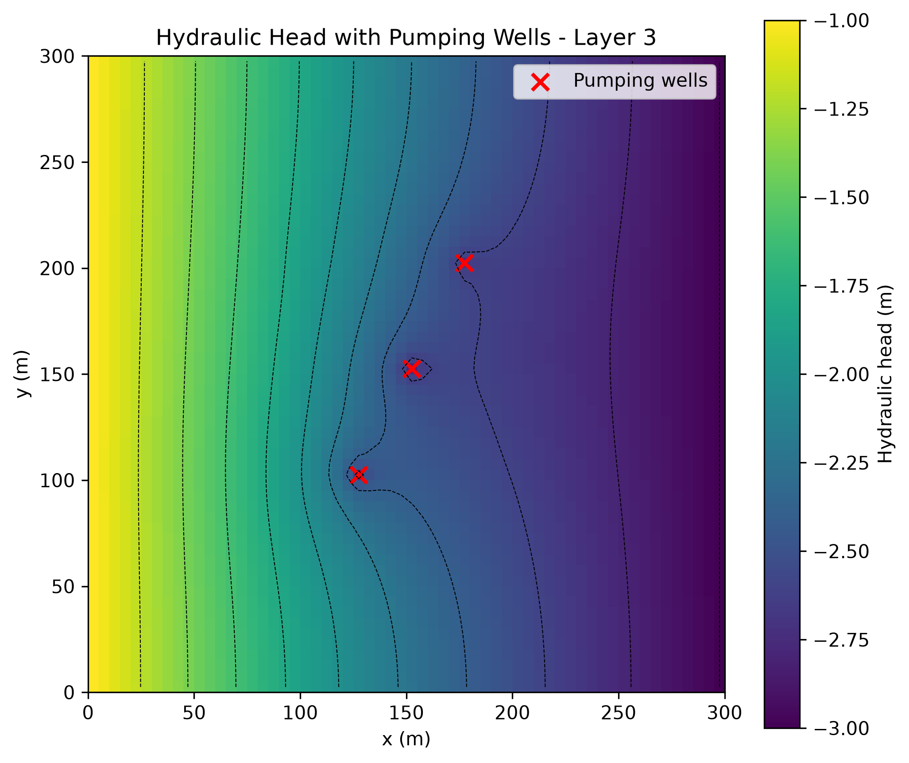

# CPT-Informed MODFLOW 6 Dewatering Model using FloPy

A compact groundwater-modeling portfolio project focused on **practical MODFLOW 6 model building with FloPy**. CPT data are used to support a simplified hydrostratigraphic interpretation, define model layers, and assign transparent scenario-based hydraulic conductivity values for a three-layer dewatering model.

This is a **conceptual portfolio model**, not a calibrated site model.

---

## Key model outputs

### Pumping-only drawdown, Layer 3



The pumping-only drawdown was calculated by comparing two separate MODFLOW simulations:

```text
drawdown = head_without_pumping - head_with_pumping
```

This removes the effect of the regional hydraulic gradient and isolates the drawdown caused by the pumping wells.

Base-case result:

```text
Maximum pumping-only drawdown ≈ 0.87 m
```

---

### Hydraulic conductivity sensitivity



A sensitivity test was performed by changing the hydraulic conductivity of Layer 3. The result shows that the simulated drawdown is strongly controlled by the K value assigned to the deeper sandy layer.

| Layer 3 K (m/day) | Maximum pumping-only drawdown (m) |
| ----------------: | --------------------------------: |
|                 5 |                              1.60 |
|                10 |                              0.87 |
|                20 |                              0.46 |

Lower hydraulic conductivity leads to higher drawdown, while higher hydraulic conductivity leads to lower drawdown.

---

### CPT-informed hydrostratigraphic interpretation



The CPT profiles were used to define a simplified three-layer hydrostratigraphic concept:

| Layer | Depth interval | Conceptual interpretation         |
| ----: | -------------: | --------------------------------- |
|     1 |          0–4 m | Shallow mixed / loose material    |
|     2 |         4–10 m | Intermediate sandy-silty material |
|     3 |        10–19 m | Deeper, denser sandy layer        |

The interpretation is simplified and intended for conceptual groundwater model building.

---

### Low-permeability zone in Layer 2



A schematic low-permeability zone was added in Layer 2 to represent a possible silt/clay lens or lower-permeability interval.

```text
Layer 2 background K = 3.0 m/day
Low-K zone K         = 0.3 m/day
```

---

### Simulated hydraulic head, Layer 3



The simulated head field shows a regional gradient from the left constant-head boundary to the right constant-head boundary, with local drawdown around the pumping wells.

---

## Project focus

This project was designed to demonstrate practical groundwater model-building skills:

* processing CPT data in Python
* calculating CPT indicators such as cone resistance `qc`, sleeve friction `fs`, and friction ratio `Rf`
* interpreting simplified hydrostratigraphic layers
* building a three-layer MODFLOW 6 groundwater-flow model with FloPy
* assigning transparent CPT-index-based scenario K values
* adding heterogeneity through a low-K zone
* simulating dewatering wells
* checking the water budget
* calculating pumping-only drawdown
* testing sensitivity to hydraulic conductivity

---

## CPT-based hydraulic conductivity approach

The hydraulic conductivity values are **not calibrated field K values** and are **not directly derived from a formal CPT-to-K correlation**.

Instead, the model uses a transparent CPT-index-based ranking approach. For each interpreted layer, the median cone resistance `qc` and median friction ratio `Rf` are calculated. Then a relative CPT permeability indicator is computed:

```text
K_index = median(qc / (Rf + 0.5))
```

The logic is:

```text
higher qc + lower Rf  → more sandy / more permeable behavior
lower qc or higher Rf → finer / less permeable behavior
```

The three layers are ranked by `K_index`, and scenario K values are assigned as low, medium, and high permeability classes.

Base-case CPT-index results:

| Layer | qc median (MPa) | Rf median (%) | K_index | Assigned K (m/day) |
| ----: | --------------: | ------------: | ------: | -----------------: |
|     1 |            2.11 |          1.06 |    1.52 |                  1 |
|     2 |            5.50 |          0.60 |    5.36 |                  3 |
|     3 |            7.32 |          0.65 |    7.23 |                 10 |

This makes the workflow CPT-informed, while keeping the hydraulic conductivity values transparent, scenario-based, and suitable for conceptual MODFLOW model building.

---

## MODFLOW model setup

| Item                |                Value |
| ------------------- | -------------------: |
| Model code          |            MODFLOW 6 |
| Python interface    |                FloPy |
| Domain size         |        300 m × 300 m |
| Grid                | 60 rows × 60 columns |
| Layers              |                    3 |
| Top elevation       |                  0 m |
| Bottom elevations   |   -4 m, -10 m, -19 m |
| Simulation time     |             365 days |
| Recharge            |         0.0003 m/day |
| Left boundary head  |                 -1 m |
| Right boundary head |                 -3 m |
| Total pumping rate  |           180 m³/day |

Three pumping wells are placed in Layer 3:

| Well | Pumping rate (m³/day) |
| ---: | --------------------: |
|    1 |                   -80 |
|    2 |                   -60 |
|    3 |                   -40 |

---

## Water budget check

The water budget confirms that the pumping demand is mainly supplied by recharge and constant-head boundary inflow.

Example base-case budget:

| Budget term   | Flow (m³/day) |
| ------------- | ------------: |
| Constant head |        +151.2 |
| Recharge      |         +26.1 |
| Wells         |        -180.0 |

This confirms that the model response is numerically consistent for the conceptual dewatering scenario.

---

## How to run

Install the required Python packages:

```bash
pip install -r requirements.txt
```

Run the main model script:

```bash
python 01_cpt_informed_modflow_model.py
```

The script tries to find the MODFLOW 6 executable in this order:

```text
1. MF6_EXE environment variable
2. mf6 available in system PATH
3. local Windows fallback path
```

If MODFLOW 6 is not found, install MODFLOW 6 and either add it to PATH or set the `MF6_EXE` environment variable.

---

## Repository structure

```text
data/
figures/
notebooks/
01_cpt_informed_modflow_model.py
02_pumping_drawdown_comparison.py
03_sensitivity_k_layer3.py
04_sensitivity_summary_plot.py
README.md
requirements.txt
```

Main output figures:

```text
figures/pumping_only_drawdown_layer3.png
figures/sensitivity_k_layer3_drawdown.png
figures/cpt_profiles_with_layers.png
figures/hydraulic_conductivity_layer2_low_k_zone.png
figures/head_with_recharge_and_wells_layer3.png
```

---

## Limitations

This is a conceptual portfolio model, not a calibrated site model.

Main limitations:

* CPT interpretation is simplified.
* Hydraulic conductivity values are approximate scenario parameters.
* K values are assigned from a relative CPT-index ranking, not from calibrated field permeability tests.
* Boundary conditions are simplified.
* The low-K zone is schematic.
* No groundwater-level calibration is included.
* No pumping-test or slug-test calibration is included.

---

## Purpose

The purpose of this project is to demonstrate a practical workflow for connecting CPT-supported hydrostratigraphic interpretation with MODFLOW 6 groundwater-flow and dewatering modeling using Python and FloPy.

The emphasis is on practical model building, transparent assumptions, water-budget checking, pumping-only drawdown analysis, and sensitivity testing.
